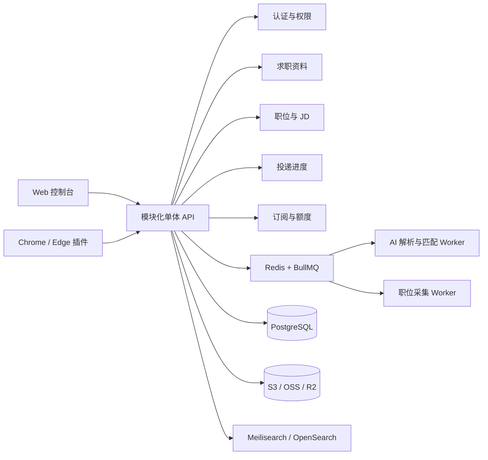

# 求职助手平台系统架构

## 1. 产品边界

平台由官网/控制台和 Chrome、Edge 浏览器插件组成。核心链路是：用户保存求职资料，打开招聘页面，插件读取岗位与表单字段，服务端进行规则匹配和 AI 补充，用户确认后由插件填写，并把职位加入投递看板。

产品只提供识别、匹配和填写建议，不代替用户点击最终提交按钮。

## 2. 总体架构



早期不拆微服务。保持一个可独立部署的 API 项目，只有耗时任务通过队列交给 Worker；当职位采集或 AI 负载明显增长时，再把 Worker 独立扩容。

## 3. 推荐技术栈

### Web 控制台

- Next.js + TypeScript
- Tailwind CSS
- TanStack Query
- 页面：个人资料、简历、职位列表、投递看板、订阅与用量、支持网站

### API 与任务

- NestJS + Prisma
- REST API（插件兼容性优先）
- PostgreSQL：业务数据
- Redis + BullMQ：队列、缓存、限流和短期状态
- Python 或 TypeScript Worker：JD 解析、表单归一化、字段匹配和通知

### 浏览器插件

- Manifest V3
- TypeScript + React
- Content Script：读取招聘页面
- Background Service Worker：登录态、API 通信和任务调度
- Side Panel：显示识别结果、候选值、置信度和确认按钮
- Adapter：为 Workday、Greenhouse、Lever、SmartRecruiters 等 ATS 提供站点规则，generic adapter 作为兜底

## 4. 自动填写数据流

```text
DOM 表单
  -> 页面字段抽取
  -> 标准字段模型
  -> 规则/历史映射匹配
  -> AI 处理未知字段
  -> 返回候选值、来源、置信度
  -> 用户确认
  -> 插件填写
  -> 记录投递事件
```

标准字段模型示例：

```ts
type FormField = {
  fieldType: string;
  label: string;
  selector?: string;
  value?: string;
  confidence: number;
  source: "profile" | "rule" | "ai" | "user";
};
```

AI 服务封装为稳定接口：

- `parseJobDescription()`
- `parseFormFields()`
- `matchProfileToFields()`
- `generateApplicationAnswer()`

这样可以替换模型供应商，而不影响插件和业务模块。

## 5. 业务模块和数据模型

后端模块建议：

```text
auth/
users/
profiles/
resumes/
jobs/
applications/
browser-extension/
ai/
billing/
notifications/
admin/
```

第一版数据表：

`users`、`profiles`、`educations`、`experiences`、`projects`、`resumes`、`jobs`、`job_sources`、`applications`、`application_events`、`field_mappings`、`subscriptions`、`usage_records`。

`applications` 保存当前状态，`application_events` 保存状态历史。状态建议包括 `saved`、`applied`、`assessment`、`interview`、`offer`、`rejected` 和 `withdrawn`。

## 6. 职位采集策略

按风险从低到高分阶段实现：

1. 用户通过插件主动保存当前职位。
2. 接入公开 API 或明确允许抓取的平台。
3. 增加定时采集、去重、结构化和全文搜索。

采集器需要限速、重试、来源标记和去重键；不绕过验证码或访问控制，并单独评估目标平台的服务条款。

## 7. 安全与隐私

- 简历、联系方式和附件按敏感数据处理。
- 传输全程 HTTPS，数据库敏感字段加密，文件使用私有对象存储和短期签名 URL。
- 插件只申请必要的 host 权限，并提供清晰的权限说明。
- API 按用户隔离数据，所有 AI 调用记录用量但避免记录不必要的原文。
- 不保存招聘网站密码，不自动提交申请。
- 真实简历、Token 和本地配置只放在未提交的环境文件中。

## 8. MVP 范围

第一阶段只实现：注册登录、求职资料、Chrome 插件、当前页面职位识别、字段识别和确认填写、投递看板、基础额度。

暂缓：大规模爬虫、自动投递、原生 App、自建向量数据库和复杂推荐系统。

## 9. 部署演进

### MVP

Vercel 部署 Web，Railway/Render 部署 API 与 Worker，Supabase 托管 PostgreSQL，Upstash 托管 Redis，Cloudflare R2/OSS 存放文件，GitHub Actions 做 CI/CD。

### 增长阶段

使用 CDN、托管 PostgreSQL、独立 Worker 集群、OpenSearch 和对象存储 CDN；根据队列长度和 AI 调用量分别扩容。
