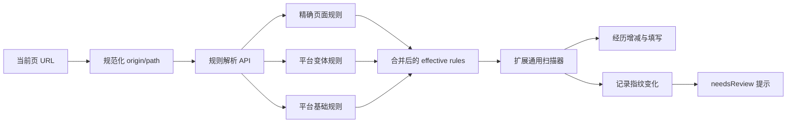

# 自动填写页面规则存储设计

## 当前落地版：一张核心规则表

为了避免第一版过度拆表，实际实现先采用现有用户简历表加一张 `AutofillRuleSet`。字段规则、重复组、选项和日期规则都在 `rules_jsonb` 中；运行记录、逐字段结果和审计事件后置。

建议的核心字段如下：

```text
AutofillRuleSet
  id                  String    @id @default(cuid())
  scope               String    // generic | platform | variant | tenant
  platformKey         String?   // moka | beisen_phoenix | feishu_recruiting
  sourceKey           String    // 规范化 origin + pathPattern
  origin              String
  pathPattern         String
  queryPolicy         String    @default("ignore")
  parentRuleSetId     String?   // 继承的平台/变体规则
  supersedesId        String?   // 上一版本
  versionNo           Int
  state               String    @default("draft")
  health              String    @default("healthy")
  needsReview         Boolean   @default(false)
  rules               Json
  fingerprintHash     String?   // 仅漂移提示
  fingerprintSummary  Json?
  createdByUserId     String?
  reviewedByUserId    String?
  publishedAt         DateTime?
  createdAt            DateTime  @default(now())
  updatedAt            DateTime  @updatedAt
```

约束和索引：

- `@@unique([sourceKey, versionNo])`；
- `@@index([sourceKey, state])`；
- `@@index([platformKey, scope, state])`；
- 每个 `sourceKey` 只能有一个 `published` 版本，由事务和 PostgreSQL 部分唯一索引共同保证；
- `parentRuleSetId` 只允许继承已发布的父版本，不能形成环。

`rules` 采用按语义键索引的 JSON，便于父子规则合并：

```json
{
  "schemaVersion": "page-rules.v1",
  "fields": {
    "profile.name": {
      "sourcePath": "profile.name",
      "controlKind": "text",
      "locator": {"labelTokens": ["姓名", "name"], "role": "textbox"}
    }
  },
  "repeatGroups": {
    "experience": {
      "recordType": "experience",
      "mode": "inline",
      "add": {"tokens": ["添加", "新增", "增加"]},
      "remove": {"tokens": ["删除", "移除"]},
      "fieldOrder": ["experience.company", "experience.title", "experience.startDate"]
    }
  },
  "options": {
    "experience.workType.full_time": {
      "pageTexts": ["正式"],
      "matchMode": "confirmed_equivalent"
    },
    "record.publication.extra.authorRole.first_author": {
      "pageTexts": ["一作", "第一作者"],
      "matchMode": "alias",
      "requiresCurrentOption": true
    }
  },
  "dates": {
    "experience.startDate": {
      "inputMode": "custom_picker",
      "granularity": "month",
      "format": "YYYY-MM"
    }
  }
}
```

父子规则合并时，字段、重复组、选项和日期分别按语义键合并；子规则只覆盖自己声明的键。标签词可以追加，控件行为和选项映射由子规则覆盖。发布时服务端可以把合并后的结果缓存为 effective snapshot，普通用户读取时不必递归多次。

第二阶段再增加最小 `AutofillRun` 表，保存运行模式、规则版本、计数、错误摘要和漂移提示。第一阶段的运行报告继续由扩展本地保存，不把简历原文、完整 HTML 或字段实际值写入后端。

## 目标

现有简历数据继续使用 `resume.autofill.v1`：`profile`、`preferences` 和带 `id/index/recordType` 的 `records` 由用户隔离保存。页面规则是另一类数据，描述“某类页面如何理解这些标准简历字段”，不保存用户的简历实际值。

规则库支持两条路径：

- 网站运营首次遇到页面时，扫描、探测、AI 辅助生成候选规则，人工确认后发布。
- 普通用户按规范化 URL 读取已发布规则，直接执行快速填写；没有规则或运行失败时回退 AI。

页面结构指纹只记录为页面漂移提示。指纹变化不会参与规则选择、字段匹配、字段定位或填写阻断。只有实际运行结果证明规则失效时，才把规则标记为 `broken` 或发布新版本。

## 存储原则

1. **关系字段负责查询、权限、版本和状态；JSONB 负责可扩展的声明式匹配描述。** 不把所有内容塞进一个不可查询的大 JSON，也不为每个页面写代码。
2. **规则存语义，不存选择器。** 可以保存标签词、ARIA role、控件类型、组标题词、组内相对顺序和相邻文本等通用证据；不保存 CSS selector、随机 class、精确 DOM 路径或网站专用脚本。
3. **版本不可变。** 发布后的规则不原地覆盖；修订创建新版本，支持审核、比较和回滚。
4. **规则和健康度分离。** `state` 表示发布流程，`health/needsReview` 表示运行健康状况。指纹变化只产生 `needsReview` 和漂移记录，仍允许已发布规则继续运行。
5. **个人数据最小化。** 规则不保存姓名、电话、工作描述等简历值。扫描原文、HTML、目标值和实际值只在必要的运行证据中短期保存，并应脱敏或加密。

## MVP 取舍：先用一张新增核心表

上面的表按业务职责拆开，适合后续运营工作台和复杂审计；第一版不需要全部落地。建议核心版本先只新增一张表：

1. `autofill_rule_sets`：同时保存页面来源、规则版本、发布状态和完整 `rules_jsonb`。

现有的用户简历表继续保存简历数据，不新增用户字段。第一版不单独建立 `field_rules`、`repeat_rules`、`option_rules` 和 `date_rules` 表，它们先作为 `rules_jsonb.fields`、`rules_jsonb.repeatGroups`、`rules_jsonb.options` 和 `rules_jsonb.dates` 保存。服务端用 JSON Schema 校验规则结构，执行路径只按 `origin/pathPattern/state` 查询规则，不需要给 JSONB 建复杂索引。

本次运行报告先由扩展保存在本地并显示给运营人员，不写后端。需要多人运营、跨用户失败统计、规则健康度或可追溯审计时，再增加 `autofill_runs`；它只保存摘要，不保存简历原文。规则审核、发布和回滚先通过 `rule_sets.state`、`version_no`、`supersedes_id` 完成；需要完整审计时再增加 `autofill_rule_events`。当运营需要按字段、选项或失败原因跨页面检索时，再把 JSONB 数组迁移为子表，同时保留完整快照兼容现有 API。

## 核心表

### `autofill_page_sources`

页面来源索引。普通用户首先按它解析规则，不查结构指纹。

| 字段 | 说明 |
| --- | --- |
| `id` | CUID/UUID 主键 |
| `source_key` | 规范化 `origin + pathPattern`，唯一 |
| `origin` | 例如 `https://zhaopin.example.com` |
| `path_pattern` | 例如 `/resume-detail`，动态 ID 用模板表示 |
| `query_policy` | `ignore`、白名单参数等；不保存 token 或完整查询串 |
| `name` | 运营可读名称 |
| `status` | `active`、`disabled` |
| `created_by` | 运营用户，可为空 |
| `created_at/updated_at` | 时间戳 |

### `autofill_rule_sets`

一个页面来源的一次完整规则快照。`rules_jsonb` 是执行时读取的完整声明，子表用于查询、局部审核和审计。

| 字段 | 说明 |
| --- | --- |
| `id` | 规则版本 ID |
| `page_source_id` | 页面来源 |
| `schema_version` | 例如 `page-rules.v1` |
| `version_no` | 来源内递增版本 |
| `state` | `draft`、`review`、`published`、`deprecated`、`rolled_back` |
| `health` | `healthy`、`review`、`broken` |
| `needs_review` | 是否需要运营复核 |
| `supersedes_id` | 上一版本 |
| `rules_jsonb` | 完整规则快照 |
| `fingerprint_hash` | 最近一次页面结构指纹，仅作漂移提示 |
| `fingerprint_summary_jsonb` | 字段数、分组数、控件类型等摘要 |
| `fingerprint_observed_at` | 最近观察时间 |
| `created_by/reviewed_by` | 创建和审核人 |
| `published_at/created_at` | 时间戳 |

约束：`(page_source_id, version_no)` 唯一；每个来源最多一个 `published` 版本。回滚是切换当前发布版本，不修改历史行。

### `autofill_field_rules`

每条标准简历字段到页面控件的声明式映射。

| 字段 | 说明 |
| --- | --- |
| `rule_set_id` | 规则版本 |
| `semantic_key` | 例如 `profile.name`、`education.school`、`experience.company` |
| `source_path` | 对应 `profile/name` 或 `record/experience/company` |
| `record_type/group_key` | 所属简历记录和页面重复组 |
| `control_kind` | `text`、`textarea`、`native_select`、`custom_select`、`date`、`checkbox` 等 |
| `fill_strategy` | 文本输入、选项选择、日期选择等 |
| `locator_spec` | 泛化语义证据 JSON |
| `required` | 页面是否要求该字段 |
| `confidence/priority` | 运营或 AI 生成的置信度和冲突优先级 |

`locator_spec` 示例：

```json
{
  "labelTokens": ["姓名", "name"],
  "role": "textbox",
  "type": "text",
  "scope": "profile",
  "nearbyTokens": ["基本信息"],
  "relativeOrder": 0
}
```

这里不保存 CSS 选择器、随机 class、精确 DOM 路径或用户本次页面的 `field-12`。运行时仍需结合当前扫描结果和语义证据定位控件。

### `autofill_repeat_rules`

描述教育、工作、项目等重复组如何探测和增减。

| 字段 | 说明 |
| --- | --- |
| `rule_set_id/group_key/record_type` | 规则版本、页面分组、简历记录类型 |
| `mode` | `inline`、`modal`、`step` |
| `min_records/max_records/allow_zero` | 数量约束 |
| `field_order` | 组内语义字段顺序 |
| `add_action` | 添加/新增/增加等语义词和作用域 |
| `remove_action` | 删除/移除等语义词和作用域 |
| `save_cancel_behavior` | 弹窗保存、取消的动作语义 |
| `probe_policy` | 是否真实点击、MutationObserver、回滚和计数检查 |
| `confidence` | 规则置信度 |

### `autofill_option_rules`

把简历标准枚举映射到页面真实选项。只有运营确认或规则验证通过的等价关系才能发布。

| 字段 | 说明 |
| --- | --- |
| `rule_set_id` | 规则版本 |
| `semantic_key` | 例如 `experience.workType` |
| `source_enum` | 规范值，例如 `full_time` |
| `page_text/page_value` | 页面选项显示文本和值 |
| `normalized_aliases` | 可接受的同义词 |
| `match_mode` | `exact`、`normalized`、`alias`、`confirmed_equivalent`、`ambiguous` |
| `requires_current_option` | 当前页面探测不到该选项时不得强行填写 |
| `confidence/status` | 置信度和 `active/review/rejected` |
| `evidence_run_id` | 产生该映射的运行记录 |

例如 `全职 → 正式` 只能作为运营确认后的 `confirmed_equivalent` 入库。AI 不能凭空生成页面选项；运行时仍要检查当前探测到的选项。

### `autofill_date_rules`

描述日期控件行为，不保存具体日期值：粒度（年月/年月日）、格式、原生输入或日历、开始/结束角色、点击确认和取消语义。

### `autofill_runs`

每次真实运行的摘要，可区分运营首次探索、普通快速填写和 AI 回退。

建议字段：`id`、`user_id`、`page_source_id`、`rule_set_id`、`mode`、规范化 URL、开始/结束时间、状态、当前指纹、`fingerprint_changed`、操作前/目标/操作后记录数、扫描和分组数量、匹配/填写/跳过/不支持/失败数量、AI 使用和耗时、错误摘要。

### `autofill_run_snapshots` 与 `autofill_run_results`

- `autofill_run_snapshots` 保存初次扫描、探测后、重扫、选项探测等阶段的脱敏证据，可设置 TTL。普通用户只保留摘要；运营候选规则才保留必要的 raw 字段。
- `autofill_run_results` 保存字段或分组级的 `filled/skipped/unsupported/failed` 结果、语义键、规则字段 ID、来源键、选项规则 ID、原因和耗时。默认不保存明文简历值；如确需排错，使用加密或哈希摘要。

### `autofill_rule_observations` 与 `autofill_rule_events`

`autofill_rule_observations` 记录 `fingerprint_changed`、字段缺失、选项变化、添加探测失败等漂移信号；包含旧/新指纹、差异摘要、严重度和建议动作。指纹变化只写这里并把 `needs_review=true`，不改变规则匹配。

`autofill_rule_events` 记录候选、审核、发布、回滚、废弃等状态变更，保留操作者、原因和版本差异。

## 规则快照示例

`autofill_rule_sets.rules_jsonb` 可以采用以下结构：

```json
{
  "schemaVersion": "page-rules.v1",
  "source": {
    "origin": "https://zhaopin.example.com",
    "pathPattern": "/resume-detail",
    "queryPolicy": "ignore"
  },
  "fields": [
    {
      "semanticKey": "profile.name",
      "sourcePath": "profile.name",
      "groupKey": "profile",
      "controlKind": "text",
      "strategy": "text",
      "required": true,
      "locator": {
        "labelTokens": ["姓名", "name"],
        "role": "textbox",
        "scope": "profile",
        "relativeOrder": 0
      },
      "confidence": 0.99
    },
    {
      "semanticKey": "experience.company",
      "sourcePath": "record.experience.company",
      "groupKey": "experience",
      "controlKind": "text",
      "strategy": "text",
      "locator": {
        "labelTokens": ["公司名称", "company"],
        "role": "textbox",
        "scope": "repeat-record",
        "relativeOrder": 0
      },
      "confidence": 0.96
    }
  ],
  "repeatGroups": [
    {
      "groupKey": "experience",
      "recordType": "experience",
      "mode": "inline",
      "countPolicy": "allAvailable",
      "allowZero": true,
      "add": {"tokens": ["添加", "新增", "增加"], "scope": "group"},
      "remove": {"tokens": ["删除", "移除"], "scope": "record"},
      "probe": {"required": true, "rollback": "restore-count-and-original-values"},
      "fieldOrder": [
        "experience.company",
        "experience.title",
        "experience.startDate",
        "experience.endDate"
      ]
    }
  ],
  "options": [
    {
      "semanticKey": "experience.workType",
      "sourceEnum": "full_time",
      "page": {"texts": ["正式"], "values": ["fulltime"]},
      "matchMode": "confirmed_equivalent",
      "requiresCurrentOption": true,
      "confidence": 0.97
    }
  ],
  "dates": [
    {
      "semanticKey": "experience.startDate",
      "inputMode": "custom_picker",
      "granularity": "month",
      "format": "YYYY-MM",
      "rangeRole": "start",
      "strategy": "calendar-select"
    }
  ]
}
```

## 后端数据流

### 普通用户已知页面



1. 扩展读取当前 URL，服务端按 `origin/pathPattern/queryPolicy` 规范化；不使用结构指纹选规则。
2. 服务端按“精确页面 → 页面变体 → 平台基础 → 通用规则”查找，并合并父子规则。
3. 扩展用合并后的规则驱动通用扫描、添加/删除经历、文本/日期/选项填写。
4. 当前页面生成的结构指纹只用于设置 `needsReview` 或返回漂移提示；它不改变本次规则选择。
5. 规则已知但某字段无法处理时，只把该字段标记为待处理或进入局部 AI，不重新请求整套规则。

### 网站运营首次建立页面规则


1. 未知页面先扫描、探测添加/删除/弹窗/选项，并生成 URL 来源。
2. AI 只生成字段语义、来源路径、重复组、真实选项和日期行为，不生成 JavaScript、CSS selector 或简历值。
3. 服务端校验 `sourcePath` 是否属于 `resume.autofill.v1`，校验规则 JSON Schema，并把候选保存为 `draft`。
4. 运营确认后生成不可变新版本，状态变为 `published`；已有版本不覆盖。
5. 若页面属于 Moka、北森或飞书平台，候选规则可以继承平台基础版本，只保存公司差异。

### 规则更新

```text
URL 命中旧规则
→ 执行并记录失败/不支持项
→ 指纹变化仅设置 needsReview
→ 运营或 AI 生成新 draft
→ 审核发布新版本
→ 旧版本保留，可回滚
```

## 建议接口

- `GET /autofill/rules/resolve?origin=...&path=...`：普通用户按 URL 获取合并后的已发布规则和版本信息。
- `POST /autofill/rules/drafts`：运营流程提交 AI 候选规则；服务端校验 schema、`sourcePath` 和父版本权限。
- `POST /autofill/rules/:id/publish`：运营审核后发布新版本，事务中切换当前 published 版本。
- `POST /autofill/rules/:id/review`：记录指纹漂移或运行失败提示；第一阶段只更新 `needsReview`。
- `GET /profiles/me/autofill-context`：继续使用现有接口获取用户标准化简历，不与页面规则表耦合。

## 运行与更新流程

1. 规范化当前 URL，查询 `autofill_page_sources`；不查询结构指纹。
2. 读取当前 `published` 规则，扫描 raw DOM，按 `locator_spec` 的语义证据定位控件。
3. 执行真实新增/删除/选项探测，按照规则填写；当前选项不满足 `option_rules` 时标记待处理或进入 AI 回退。
4. 第一阶段把结果保存在扩展本地；第二阶段再写入 `autofill_runs`。结构指纹变化只产生 `fingerprint_changed` 提示和 `needs_review`。
5. 未知页面由运营路径生成 `draft` 规则；AI 只能输出字段、来源、记录、真实选项 ID，不能输出 CSS 选择器或简历值。
6. 运营审核后发布新版本；规则失败和页面不支持要分开统计。只有真实运行失败达到阈值才把 `health` 设为 `broken`。

## 平台族规则与公司覆盖

很多公司只是租用了同一个 ATS，因此不应为每家公司复制一整套规则。规则来源分三层：

```text
平台基础规则（Moka / Beisen-Phoenix / Beisen-iTalentX / Feishu Recruiting）
        ↓ 继承
平台页面变体规则（简历编辑、申请表、校园招聘等）
        ↓ 覆盖
公司或具体页面的少量差异规则
```

在 `autofill_rule_sets` 中增加以下元数据即可支持继承，不需要新增表：

- `scope`：`platform`、`variant`、`tenant`；
- `platform_key`：例如 `moka`、`beisen_phoenix`、`beisen_italentx`、`feishu_recruiting`；
- `source_key`：规范化 URL 来源；平台规则可以使用平台路由模板，具体页面规则使用精确来源；
- `priority`：同层规则冲突时的优先级；
- `parent_rule_set_id`：继承的基础规则版本。

运行时按以下顺序合并：

1. URL 精确匹配的已发布公司/页面规则；
2. 已识别平台和页面变体的已发布规则；
3. 通用规则；
4. 没有可用规则时进入 AI 探索。

平台识别优先使用规范化 URL、路由和稳定的页面语义证据。结构指纹不参与规则选择，只在运行后提示平台规则或公司覆盖可能需要复核。平台基础规则只保存通用语义和行为，不保存公司名称、简历值或站点专用 CSS selector。

例如，Moka 的基础规则可以覆盖姓名、联系方式、教育、工作、项目和常见日期控件；某家公司新增“宣讲会城市”字段时，只需发布一个 `tenant` 覆盖规则，不复制整套 Moka 规则。若公司页面改动无法用声明式规则表达，进入 AI 候选或新增通用控件能力，而不是把整段网站代码塞进规则库。

## 索引和权限

- `page_sources(source_key)` 唯一。
- `rule_sets(page_source_id, state)`，用部分唯一索引保证每个来源最多一个 `published`。
- `field_rules(rule_set_id, semantic_key, group_key)`。
- `option_rules(rule_set_id, semantic_key, source_enum)`。
- `runs(page_source_id, started_at desc)`、`runs(user_id, started_at desc)`。
- JSONB 的 GIN 索引只用于运营检索，普通用户执行路径主要使用关系索引。
- 所有运行数据都按 `user_id` 隔离；共享页面规则不带用户简历值。运营发布、回滚和读取候选规则需要独立角色权限。

## 最小落地顺序

1. 先建立 `page_sources`、`rule_sets` 和规则快照 JSONB，完成一个页面的 `draft → review → published → rollback`。
2. 加入 `field_rules`、`repeat_rules`、`option_rules`、`date_rules`，支持局部审核和查询。
3. 加入 `runs`、`snapshots`、`results`，把真实运行结果接入规则健康度。
4. 最后加入漂移观察、审核事件和运营工作台。
